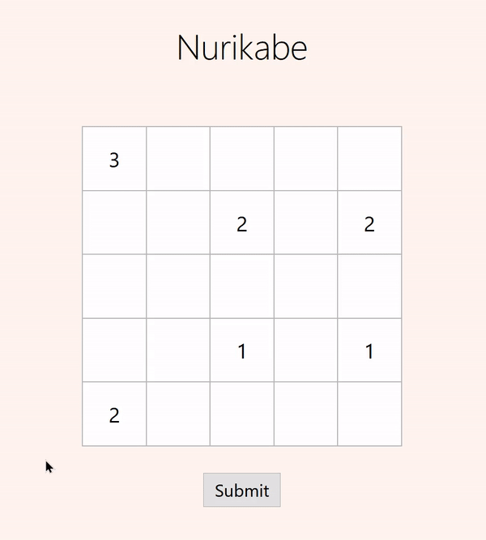

# nurikabe

Nurikabe is a logic puzzle named after the nurikabe, a spirit from Japanese folklore that is "said to manifest as an invisible wall that impedes or misdirects travelers walking at night". [1](#1) The puzzle was first published by [*Nikoli*](https://en.wikipedia.org/wiki/Nikoli_(publisher)) in 1991.

## Rules [2](#2)
Nurikabe is played on a rectangular grid of white squares, some of which contain a number. The goal is to shade the grid such that each group (or "island") of white squares contains exactly one number that represents how many white squares are in the island. Other rules include:
* Numbered cells cannot be shaded.
* There cannot be any 2 x 2 blocks of shaded or unshaded squares.
* All shaded squares must eventually be connected (forming a "sea").

## How to Play
1. Go to [http://timothyyoon.com/nurikabe/](http://timothyyoon.com/nurikabe/) for the puzzle.
2. Click on individual squares in the grid to shade or unshade them.
3. Once you are done, click on the "Submit" button to check your solution.
4. See the displayed feedback. You can modify your solution and resubmit as many times as you need.

## References
<a id="1">1.</a>
“Nurikabe.” Wikipedia, Wikimedia Foundation, 4 Aug. 2020, en.wikipedia.org/wiki/Nurikabe.

<a id="2">2.</a>
Kendall, Graham, Andrew Parkes, and Kristian Spoerer. "A survey of NP-complete puzzles." ICGA Journal 31.1 (2008): 13-34.
